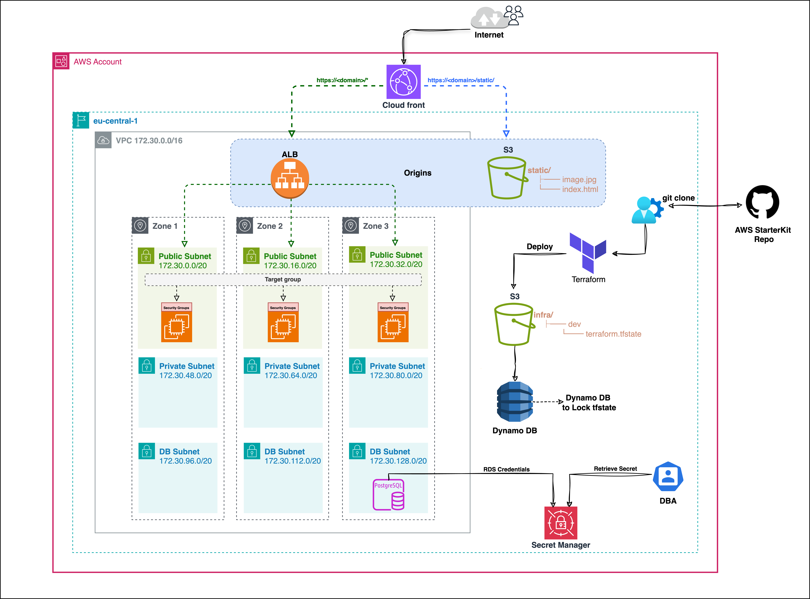

# Starterkits Project

This project provides a secure and scalable AWS infrastructure using Terraform modules. It includes configurations for VPC, EC2 instances, Application Load Balancer (ALB), CloudFront, S3, RDS, and AWS Secrets Manager for securely managing sensitive data like database credentials.

## Table of Contents

1. [Project Overview](#project-overview)
2. [Architecture and Modules Overview](#architecture-and-modules-overview)
3. [Prerequisites](#prerequisites)
4. [Setup Instructions](#setup-instructions)
    - [Set Up AWS Credentials](#1-set-up-aws-credentials)
    - [Configure Environment Variables](#2-configure-environment-variables)
    - [Generate and Configure SSH Key Pair](#3-generate-and-configure-ssh-key-pair)
    - [Secrets Management with AWS Secrets Manager](#4-secrets-management-with-aws-secrets-manager)
5. [Deployment Instructions](#deployment-instructions)
6. [Resource Configuration](#resource-configuration)
7. [Security Best Practices](#security-best-practices)
8. [Advanced Notes](#advanced-notes)

---

## Project Overview

This infrastructure starter kit helps you deploy AWS resources efficiently. By using separate modules, we ensure modularity and flexibility in managing various AWS components, following best practices for security, scalability, and availability.

## Architecture and Modules Overview

This project employs a modular architecture where each AWS service is encapsulated within its own module. This design allows for easy customization, reuse, and maintenance of infrastructure code, making it adaptable to different project requirements.

### Architecture Diagram



1. **CloudFront**: Acts as a content delivery network, accelerating access and caching static assets stored in an S3 bucket.
2. **Application Load Balancer (ALB)**: Routes traffic to EC2 instances, with optional HTTP-to-HTTPS redirection.
3. **EC2 Instances**: Hosts the application or web services, with configurations for installing services through user data scripts.
4. **VPC with Subnets**: Provides isolated networks with public, private, and database subnets for better security and network control.
5. **S3 Bucket**: Stores static content (e.g., images, HTML) for direct access via CloudFront.
6. **RDS (PostgreSQL)**: Managed database service for handling application data.
7. **Secrets Manager**: Securely stores database credentials, which are accessed by the application without embedding sensitive data in code.

### Module Overview

Each Terraform module represents a specific AWS service, making it reusable and easily configurable.

- **/modules/network**: Contains VPC, public, private, and database subnets, providing network isolation and structure.
- **/modules/ec2**: Manages EC2 instance creation, including the security groups required for controlled access.P
- **/modules/alb**: Sets up an Application Load Balancer, target groups, and listeners, with optional HTTPS redirection.
- **/modules/cloudfront**: Configures CloudFront to work with S3 for static assets and routes requests to ALB for dynamic content.
- **/modules/s3**: Manages an S3 bucket for static content, with options for website configuration and CloudFront origin access.
- **/modules/data/postgres**: Sets up an RDS instance with PostgreSQL, including subnet configuration for secure database access.
- **/modules/secret_manager**: Manages AWS Secrets Manager for securely storing and retrieving database credentials.
- **/modules/security_group**: Configures security groups for ALB, EC2, and RDS, ensuring network access is limited to specific services and ports.

## Prerequisites

- **AWS CLI** installed and configured on your machine.
- **Terraform** installed (version 0.12 or later recommended).
- **Access to an AWS account** with permissions to create resources like VPCs, EC2 instances, ALBs, CloudFront distributions, S3 buckets, and RDS instances.
- **IAM permissions** to use **AWS STS (Security Token Service)** for temporary access with Multi-Factor Authentication (MFA) if your AWS account enforces SCPs that require MFA.

## Setup Instructions

### 1. Set Up AWS Credentials

To deploy this infrastructure, you need AWS credentials. We recommend using **AWS STS with MFA** for enhanced security, especially if Service Control Policies (SCPs) enforce MFA for deployments.

1. **Generate an Access Key and Secret Key**:
   - Go to the **IAM** section in the AWS Console, select an IAM user, or create a new one with necessary permissions.
   - Under **Security credentials**, generate an **Access Key ID** and **Secret Access Key**.

2. **Configure AWS CLI**:
   - Run `aws configure` and provide your **Access Key ID**, **Secret Access Key**, and **Region**:
     ```bash
     aws configure
     ```

3. **Obtain an MFA-based Session Token** (if MFA is required):
   - Run the following command to get a session token (replace placeholders):
     ```bash
     aws sts get-session-token --serial-number arn:aws:iam::<account-id>:mfa/<username> --token-code <MFA-token>
     ```
   - **Export the Temporary Session Credentials**:
     ```bash
     export AWS_ACCESS_KEY_ID=<Your-Access-Key-ID>
     export AWS_SECRET_ACCESS_KEY=<Your-Secret-Access-Key>
     export AWS_SESSION_TOKEN=<Your-Session-Token>
     ```
   - These credentials are now ready for use with Terraform.

### 2. Configure Environment Variables

Update the `terraform.tfvars` file in `/env/dev` to set up environment-specific values:

```hcl
# Environment Configuration
infra_env                = "Development"                     # Specifies the environment (e.g., Dev, Prod)
default_region           = "eu-central-1"                    # AWS region for deploying resources
project_name             = "Sandbox"                         # Name of the project for tagging and identification

# VPC and Subnet Configuration
cidr                     = "172.30.0.0/16"                   # CIDR block for the VPC
azs                      = ["eu-central-1a", "eu-central-1b", "eu-central-1c"]  # List of availability zones for high availability
public_subnets           = ["172.30.0.0/20", "172.30.16.0/20", "172.30.32.0/20"]  # CIDRs for public subnets in each AZ
private_subnets          = ["172.30.48.0/20", "172.30.64.0/20", "172.30.80.0/20"] # CIDRs for private subnets in each AZ
database_subnets         = ["172.30.96.0/20", "172.30.112.0/20", "172.30.128.0/20"] # CIDRs for database subnets in each AZ
retention_in_days        = 14                                # Log retention period in CloudWatch

# Instance Names
instance_names = [
  "custom-name-for-instance-one",                            # Custom name for EC2 instance one
  "custom-name-for-instance-two",                            # Custom name for EC2 instance two
  "custom-name-for-instance-three"                           # Custom name for EC2 instance three
]

# EC2 Configuration
instance_type              = "t2.micro"                      # EC2 instance type (e.g., t2.micro, t3.medium)
key_name                   = ""              # Name of the SSH key pair to access instances
ami                        = "ami-08ec94f928cf25a9d"         # AMI ID for EC2 instances
associate_public_ip_address = true                           # Assign a public IP address to instances
user_data = <<-EOF
            #!/bin/bash
            sudo yum update -y
            sudo yum install -y nginx
            sudo systemctl start nginx
            sudo systemctl enable nginx
            EOF                                             
            
# ALB Configuration
alb_name                   = "my-alb"                        # Name of the Application Load Balancer (ALB)
target_group_name_prefix   = "h1"                            # Prefix for the ALB target group
target_group_port          = 80                              # Port on which the target group listens
target_group_protocol      = "HTTP"                          # Protocol for target group communication (HTTP/HTTPS)
target_type                = "instance"                      # Target type for ALB (e.g., instance, IP)
health_check_path          = "/"                             # Health check path for ALB
health_check_interval      = 30                              # Interval for ALB health checks (seconds)
health_check_timeout       = 5                               # Timeout for ALB health checks (seconds)
healthy_threshold          = 3                               # Number of successful checks for healthy status
unhealthy_threshold        = 3                               # Number of failed checks for unhealthy status
redirect_to_https          = false                           # Enable or disable HTTP to HTTPS redirection
certificate_arn            = "arn:aws:acm:region:account-id:certificate/certificate-id"  # ARN of SSL certificate for HTTPS

# CloudFront Configuration
default_ttl                = 3600                            # Default TTL for CloudFront cached objects
max_ttl                    = 86400                           # Maximum TTL for CloudFront cached objects

# S3 Bucket Configuration
bucket_name                = "logicom-cloudfront-s3-origin"  # Unique name of the S3 bucket
index_document             = "index.html"                    # Default index document for S3 website
error_document             = "error.html"                    # Default error document for S3 website
block_public_acls          = false                           # Block public ACLs (true/false)
block_public_policy        = false                           # Block public bucket policy (true/false)
ignore_public_acls         = false                           # Ignore public ACLs (true/false)
restrict_public_buckets    = false                           # Restrict public access to the bucket (true/false)

index_html_source          = "../../modules/s3/index.html"   # Path to index.html file for S3 upload
image_jpg_source           = "../../modules/s3/image.jpg"    # Path to image.jpg file for S3 upload

# RDS Configuration
rds_identifier             = "microservice-one"              # Identifier for the RDS instance
rds_sg_name                = "db-sg"                         # Name of the security group for RDS
rds_instance_class         = "db.t3.micro"                   # Instance type for RDS
rds_username               = "logicom"                       # Master username for RDS
family                     = "postgres16"                    # Parameter group family (e.g., postgres16 for PostgreSQL)
parameter_group_name       = "sandbox-pgsql-16"              # Parameter group name for RDS
availability_zone          = "eu-central-1a"                 # Availability zone for RDS instance
rds_cidrs                  = ["172.30.0.0/16"]               # Allowed CIDR ranges for RDS access

ingress_rules = [
  {
    from_port   = 5432
    to_port     = 5432
    protocol    = "tcp"
    cidr_blocks = ["10.0.0.0/16"]
    description = "Allow PostgreSQL access within VPC"
  }
]

egress_rules = [
  {
    from_port   = 0
    to_port     = 0
    protocol    = "-1"
    cidr_blocks = ["0.0.0.0/0"]
    description = "Allow all outbound traffic"
  }
]

# Secrets Manager
secret_name               = "Database-secrets"               # Name of the Secrets Manager secret

# Tags
tags = {
  Environment = "Development"                               # Environment tag for resources
  Project     = "Example"                                   # Project tag for resources
}

# Security Groups
security_group_name       = "custom-ec2-sg"                 # Name of the custom security group for EC2
allow_http                = true                            # Allow HTTP access (true/false)
allow_https               = true                            # Allow HTTPS access (true/false)
allow_ssh                 = false                           # Allow SSH access (true/false)
ssh_cidr_block            = "0.0.0.0/0"                     # CIDR block allowed for SSH (update to specific IP for security)

security_group_tags = {
  Environment = "Development"                               # Environment tag for security group
  Project     = "ExampleProject"                            # Project tag for security group
}


```
### 3. Generate and Configure SSH Key Pair

1. Generate an SSH key pair in the AWS Console.
2. Set `key_name` in `terraform.tfvars` with the key pair name.

### 4. Secrets Management with AWS Secrets Manager

We use **AWS Secrets Manager** to securely store database credentials:

- **Create a Secret in Secrets Manager**:
   - Set `secret_name` in `terraform.tfvars` with your desired secret name.
   - Terraform will handle creating and managing this secret for database credentials.

## Deployment Instructions

Follow these steps to deploy the AWS infrastructure using this project. Ensure you have completed all prerequisites and configured environment variables as outlined in the [Setup Instructions](#setup-instructions).

### Step 1: Clone the Repository

1. Clone this repository to your local machine:
   ```bash
   git clone https://github.com/Logicom-Cloud-Business-Unit/AWS-StarterKits
2. Navigate to the environment directory you want to deploy (e.g., dev):
    ```bash
   cd Starterkits/env/dev
    ```
### Step 2: Configure Terraform Variables

1. **Open the terraform.tfvars file in the /env/dev directory**

2. **Update the values as needed to fit your specific AWS environment and requirements, including values like:**
    - key_name with the name of the generated SSH key pair
    - bucket_name for the S3 bucket
    - instance_type for EC2 instances
    - Any other environment-specific settings (e.g., project_name, infra_env, etc.)

### Step 3: Initialize Terraform
1. Run the following command to initialize Terraform and download the necessary providers and modules:
    ```bash
    terraform init
    ```
### Step 4: Review the Plan
1. To preview the changes Terraform will make to your AWS environment, run:
    ```bash
    terraform plan
    ```
2. Review the output to ensure the planned actions meet your expectations.

### Step 5: Apply the Configuration
1. To deploy the infrastructure, run the following command:
    ```bash
    terraform apply
    ```

2. **Approve** the deployment by typing `yes` when prompted

### Step 6: Verify the Deployment
Once the deployment is complete, Terraform will output relevant information, including the `cloudfront_endpoint` and other details. Verify that resources are created as expected in the AWS Console.

### Step 7: Cleanup Resources (Optional)
When you are done with the environment, you can destroy the resources to avoid incurring further charges:

1. Run the destroy command in the same environment directory:
   ```bash
   terraform destroy
   ```
2. Confirm the destruction by typing `yes` when prompted.

> [!IMPORTANT]
> Destroying resources will remove all deployed infrastructure, including any data stored in RDS and S3. Ensure you have backups if needed.

> [!TIP]
> To avoid deleting resources, it's recommended to comment out the main source code rather than running `terraform destroy`. This approach keeps the infrastructure intact without active configuration changes.

## Resource Configuration

| Resource           | Variable                  | Description                                         |
|--------------------|---------------------------|-----------------------------------------------------|
| VPC                | `cidr`                    | CIDR block for the VPC                              |
| EC2                | `instance_type`           | Type of EC2 instance                                |
| ALB                | `alb_name`                | Name for the Application Load Balancer              |
| CloudFront         | `default_ttl`             | Default TTL for cached content                      |
| S3 Bucket          | `bucket_name`             | Unique name for the S3 bucket                       |
| RDS                | `rds_identifier`          | Identifier for the RDS instance                     |
| Secrets Manager    | `secret_name`             | Name of the secret to store DB credentials          |
| Security Groups    | `allow_http`              | Allow HTTP access                                   |

## Security Best Practices

1. **Use STS with MFA**: Enabling AWS STS with MFA secures temporary access, especially for deployments under Service Control Policies (SCPs) requiring MFA.
2. **Secrets Management**: AWS Secrets Manager stores sensitive credentials securely, ensuring credentials are not hardcoded.
3. **Use a Unique Key Pair**: Generate a unique SSH key pair and store it securely for EC2 instance access.

## Advanced Notes

- **Redirecting HTTP to HTTPS**: If `redirect_to_https` is `true`, ensure a valid `certificate_arn` is provided.
- **Testing Configuration**: Use sandbox or test environments to validate the setup before deploying in production.

This README.md provides everything a user needs to understand, configure, and deploy the infrastructure securely and efficiently.